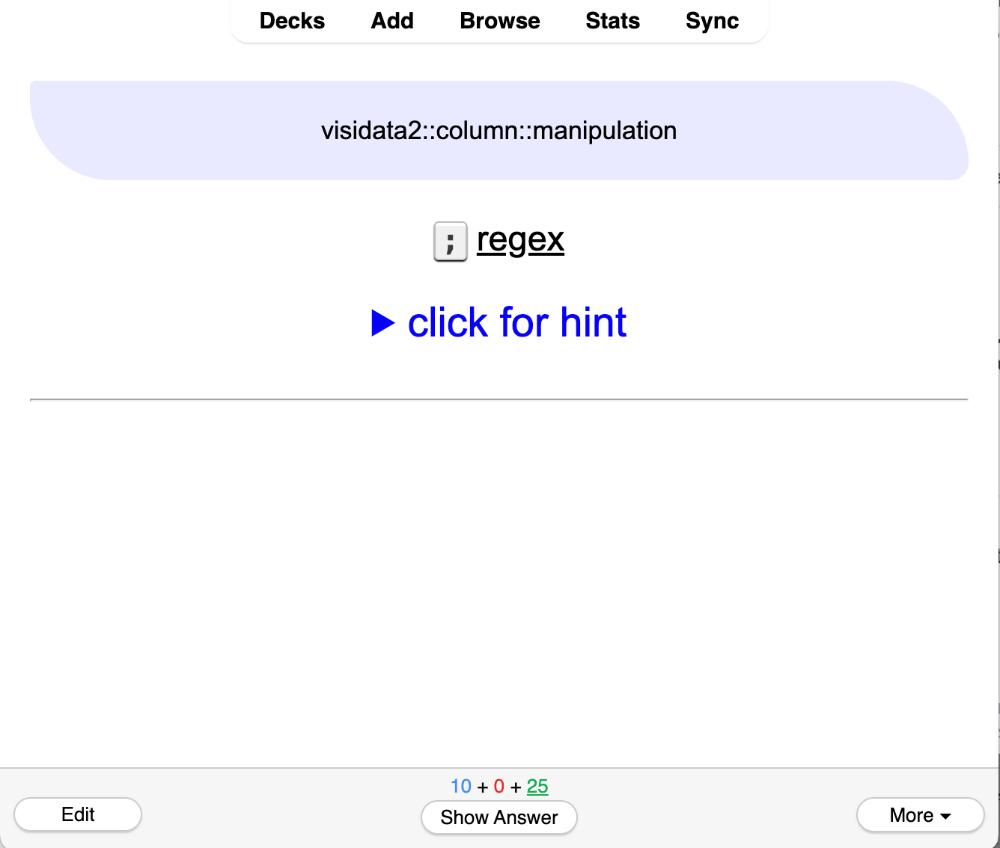
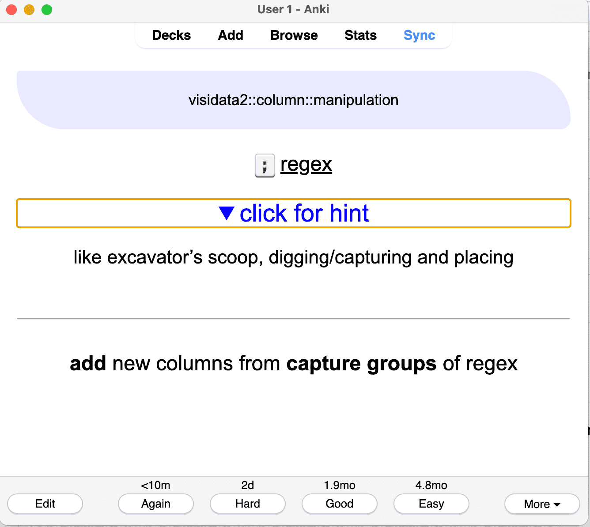

# visidata3-anki

Three Anki decks for [Visidata3.x](https://www.visidata.org/): "an interactive multitool for tabular data."
It includes introduction, beginner, and intermediate decks.

You can import this deck from the shared decks on AnkiWeb: <https://ankiweb.net/shared/info/75357212?cb=1723237489270> .

## Screenshots

### Question

### Question, hint, and answer

